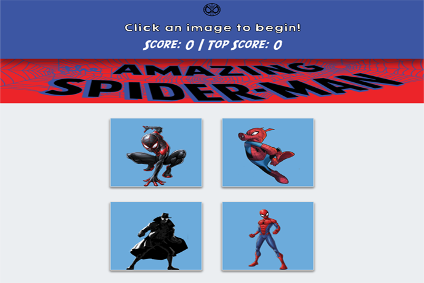

<h1 align="center">Spidey-Click</h1>

<kbd></kbd>
 

This project is a simple memory game, build with React.  The game is played by clicking an image of a Spidey character from the Spider-Man series.  The player earns points by clicking an image only once.  If a character is clicked more than once, the game starts over, but the highest score is displayed on the screen.

# Demo
* 
# Setup
In order to run the app, you will need to clone this repository and install all required technologies listed below.
# Required Technologies
1. [Node.js LTS](https://nodejs.org/en/) 
2. [NPM](https://www.npmjs.com/get-npm) 
3. [Git & Git Bash](https://git-scm.com/downloads) 

# NPM Modules Used
1. create-react-app
# Installation Steps
1. Open Bash and Clone the Spidey-Click repo
2. Install all required technologies
3. In Bash, change the current directory to the spidey-click directory and install create-react-app module using the following command:
    1. npm install -g create-react-app
4. Next install all modules from the package.json, using the following command:
    1. yarn init [Enter]  
# Execute Program
1. In Bash, enter the following command in the spidey-click directory, to start the server.
    1. yarn start [ENTER]
2. The application will open your browser and run the app in test mode:
    1. http://localhost:3000
# Use
This repo is available for public non-commercial use only.
# Goal
The goal of this project is to create and deploy a React app that manipulates JSON data.  The UI is broken into components, that manages state, and responds to user events. 